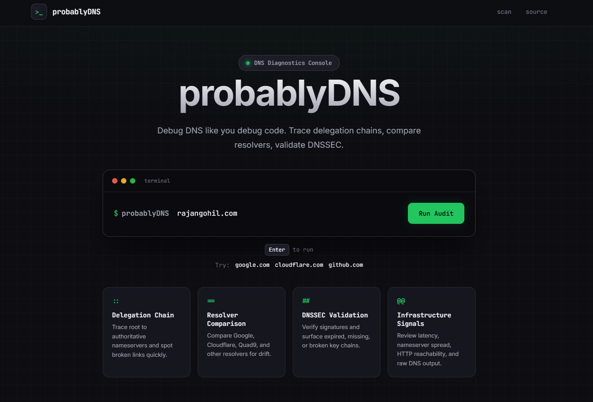
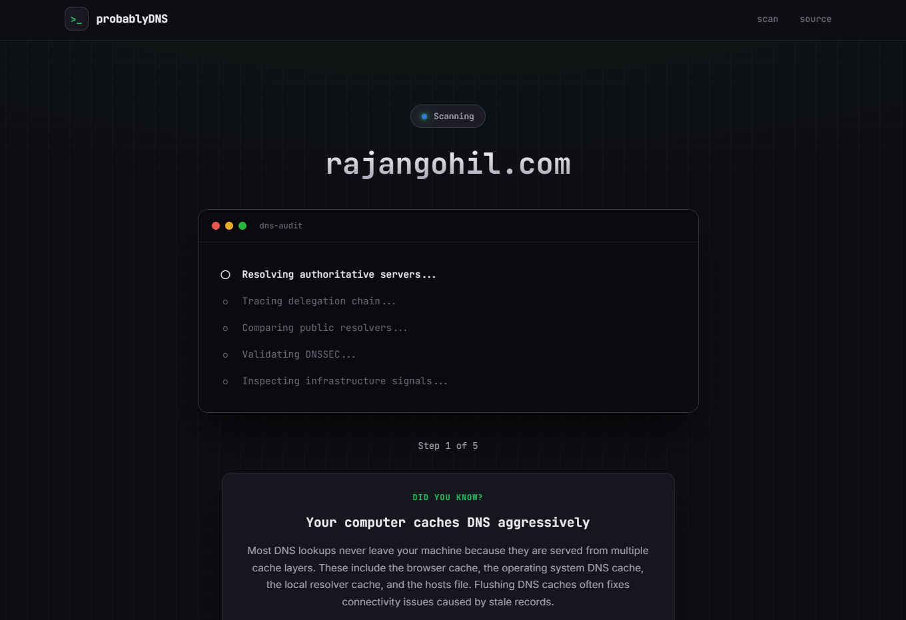
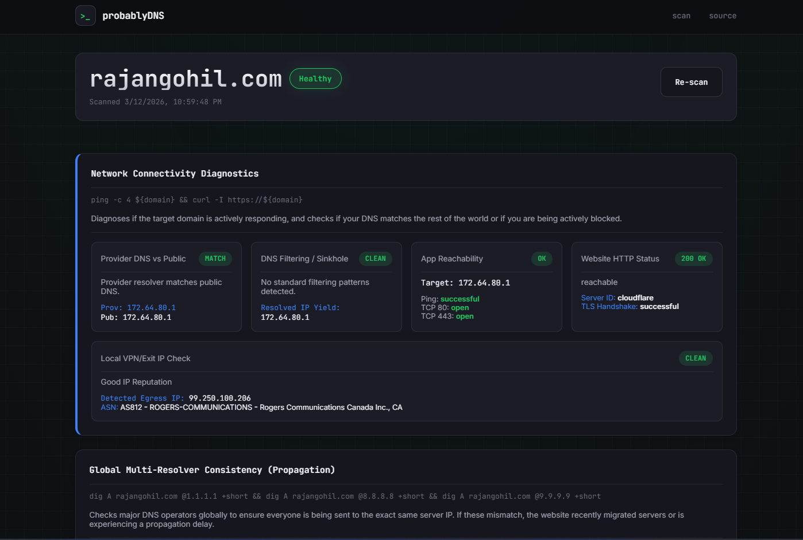

# probablyDNS

<p align="center">
  <strong>Please don't be DNS... it was DNS.</strong>
</p>

<p align="center">
  A brutally honest DNS diagnostic tool for tracing delegation failures, resolver drift, DNSSEC issues, propagation lag, and infrastructure surprises.
</p>

<p align="center">
  <a href="https://github.com/rajangohil99/probablyDNS"></a>
  
  
  
  
  
</p>

---

## Why probablyDNS

`probablyDNS` helps answer the question teams usually ask too late: is the problem actually DNS?

It combines a Python CLI and a FastAPI web app over the same backend so you can inspect a domain from multiple angles without switching tools. The project is aimed at real-world incidents, not just happy-path record lookups.

## Screenshots

### Homepage



### Scan Progress



### Results Dashboard



## What It Checks

- Delegation chain from root to authoritative nameservers
- Resolver comparison across public DNS providers
- DNS record collection and timing signals
- DNSSEC validation and related health indicators
- HTTP and reachability checks for resolved targets
- Optional extras such as WHOIS, reverse DNS, split DNS, wildcard detection, graphs, and maps

## Stack

| Layer | Used Here |
| --- | --- |
| Language | Python 3.11+ |
| Web UI | FastAPI + Uvicorn |
| CLI | Typer + Rich |
| DNS Engine | dnspython |
| Extras | python-whois, graphviz |

## Quick Start

### Install

```bash
python -m venv .venv
source .venv/bin/activate
python -m pip install --upgrade pip
python -m pip install -r requirements.txt
```

Windows PowerShell:

```powershell
python -m venv .venv
.\.venv\Scripts\python -m pip install --upgrade pip
.\.venv\Scripts\python -m pip install -r requirements.txt
```

### Run The Web App

Linux/macOS:

```bash
source .venv/bin/activate
uvicorn dns_analyzer.webapp:app --host 127.0.0.1 --port 8000
```

Windows:

```powershell
.\run_webapp.ps1
```

Open [http://127.0.0.1:8000](http://127.0.0.1:8000).

### Run The CLI

```bash
python -m dns_analyzer.cli analyze example.com
python -m dns_analyzer.cli analyze example.com --full-report
python -m dns_analyzer.cli analyze example.com --full-report --json
python -m dns_analyzer.cli analyze example.com --subdomains --whois
python -m dns_analyzer.cli analyze example.com --map
```

Useful flags:

- `--full-report`
- `--json`
- `--markdown`
- `--subdomains`
- `--whois`
- `--history`
- `--split-dns`
- `--cdn`
- `--ptr`
- `--wildcard`
- `--graph`
- `--map`

## Network Requirements

The scanner expects outbound access to:

- `UDP/53`
- `TCP/80`
- `TCP/443`

## Built-In Rate Limiting

The FastAPI app includes an in-memory limiter for the expensive scan endpoints.

- Limit: `10` requests per `60` seconds per client IP
- Paths:
  - `/analyze`
  - `/analyze/full`
  - `/report/json`
  - `/report/markdown`

Environment overrides:

```bash
export PROBABLYDNS_RATE_LIMIT_REQUESTS=10
export PROBABLYDNS_RATE_LIMIT_WINDOW_SECONDS=60
```

Notes:

- The limiter is process-local
- Multiple workers mean multiple independent counters
- For public deployment, add reverse-proxy rate limiting too

## Deploying Publicly

The included deployment guide covers:

- Linux server setup
- `systemd` service management
- `nginx` reverse proxy configuration
- TLS with Certbot
- proxy-level rate limiting

See [deployment.md](deployment.md).

## Project Files

- [deployment.md](deployment.md): Linux deployment and hardening notes
- [run_webapp.ps1](run_webapp.ps1): Windows launcher
- [run_webapp.cmd](run_webapp.cmd): Alternate Windows launcher
- [requirements.txt](requirements.txt): Python dependencies

## Source

[rajangohil99/probablyDNS](https://github.com/rajangohil99/probablyDNS)
